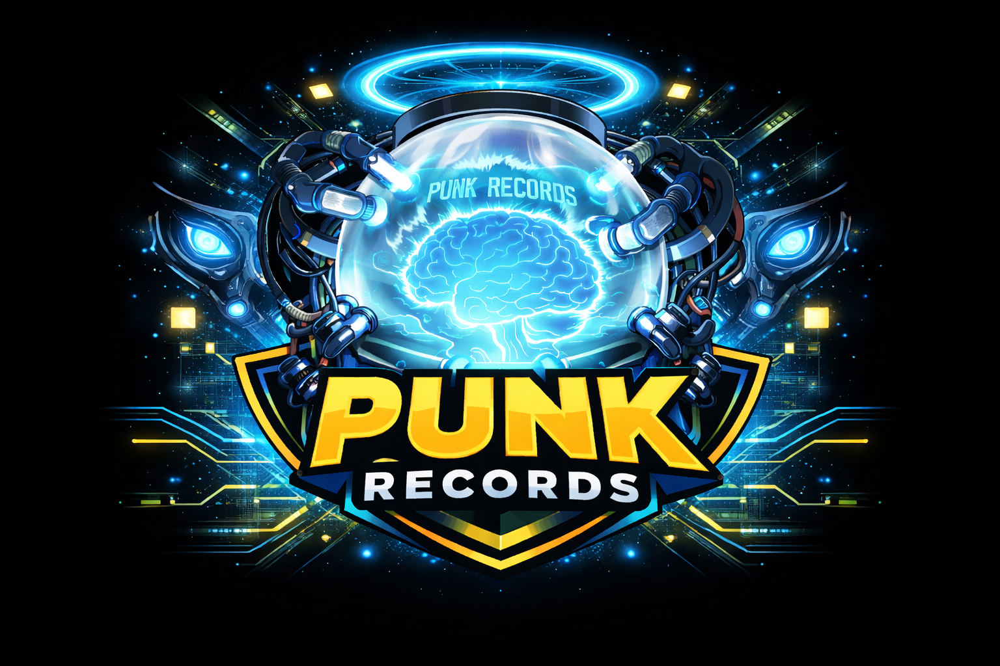

<p align="center">
  
</p>
<h3 align="center">PunkRecords · 班克记录</h3>
<p align="center">
  <em>像贝加庞克一样</em>，将你的大脑外化为无限的智慧仓库。<br />
  <br />
  连接 LLM 与个人 Wiki，让零散的笔记与灵感在此汇聚、碰撞、重生。<br />
  这是属于你的「班克记录」，一个会思考的第二大脑。
</p>

---

## 特性

- 🤖 **多 AI 代理支持** - 兼容 Claude Code、Codex、OpenCode 等多种 AI 编码代理
- 📊 **知识图谱构建** - 内置 graphify 将输入内容自动转化为结构化知识图谱
- 🔗 **Obsidian 原生集成** - 提供 Obsidian 插件直接打开关系图谱可视化
- 💬 **交互式对话** - 通过聊天界面与你的知识库进行交互查询
- 📁 **分层知识组织** - 原材料与索引分离，支持多领域知识独立管理
- 🔍 **智能知识处理** - AI 代理自动完成知识摄取、查询和整理

## 文档

- **[UI 设计规范](docs/ui_design.md)**：客户端界面、交互与文案原则；**后续所有 UI 相关设计均须在该文件中维护与更新**（单一事实来源）。
- **[API 接口需求](docs/api-outline.md)**：前后端联调所需的 REST/文件上传/可选流式与 Agent、设置等接口轮廓。

## 架构概览

PunkRecords 采用清晰的三层架构设计：

### 第一层：UI 层
- **交互式聊天界面** - 用户与 AI 代理进行自然语言交互
- **Obsidian 插件** - 直接打开 Obsidian Vault 查看知识关系图谱

### 第二层：LLM 代理层
- **AI 代理核心** - 支持多种 LLM 代理（Claude Code、Codex、OpenCode 等），负责知识摄取、查询和整理
- **graphify** - 开源组件，将内容转化为知识图谱
- **LLM Wiki** - 可选组件，提供额外的维基组织能力

### 第三层：Obsidian Vaults 层
- **本地知识库原材料 Vault** - 存储原始知识材料，按领域分类目录组织
- **领域知识索引 Vaults** - 每个领域独立一个 Vault，仅存储 Wiki 索引和图谱索引数据，索引中引用原材料 Vault 的原始数据

## 核心理念

PunkRecords 相信：
- **你的知识已经存在** - 不需要迁移，基于你现有的 Obsidian 笔记工作流
- **AI 是协作伙伴** - 帮助你整理、连接和发现知识间的关联
- **分层存储** - 原材料与索引分离，兼顾灵活性和性能
- **开放架构** - 支持多种 AI 后端，不绑定特定服务商

## 开始使用

### HTTP API（FastAPI）

```bash
poetry install
poetry run punkrecords serve --host 127.0.0.1 --port 8765
# 或
poetry run punkrecords-serve --port 8765
```

接口说明见 [`docs/api-outline.md`](docs/api-outline.md)。健康检查：`GET http://127.0.0.1:8765/api/v1/health`。

### Web 前端

```bash
cd frontend && npm install && npm run dev
```

联调后端时，在 `frontend/.env.local` 中设置：

```bash
VITE_API_BASE_URL=http://127.0.0.1:8765
```

详见 [`frontend/README.md`](frontend/README.md)。产品/交互规范见 [`docs/ui_design.md`](docs/ui_design.md)。

## 路线图

- [x] HTTP API 骨架（health / domains / chat / agents / settings）
- [ ] 基础代理框架与真实对话管线
- [ ] graphify 知识图谱构建集成
- [ ] Obsidian 插件开发
- [ ] 多 Vault 知识索引管理
- [x] 交互式聊天界面（Web，可联调 API）
- [ ] 支持多种 AI 代理后端（端到端）

