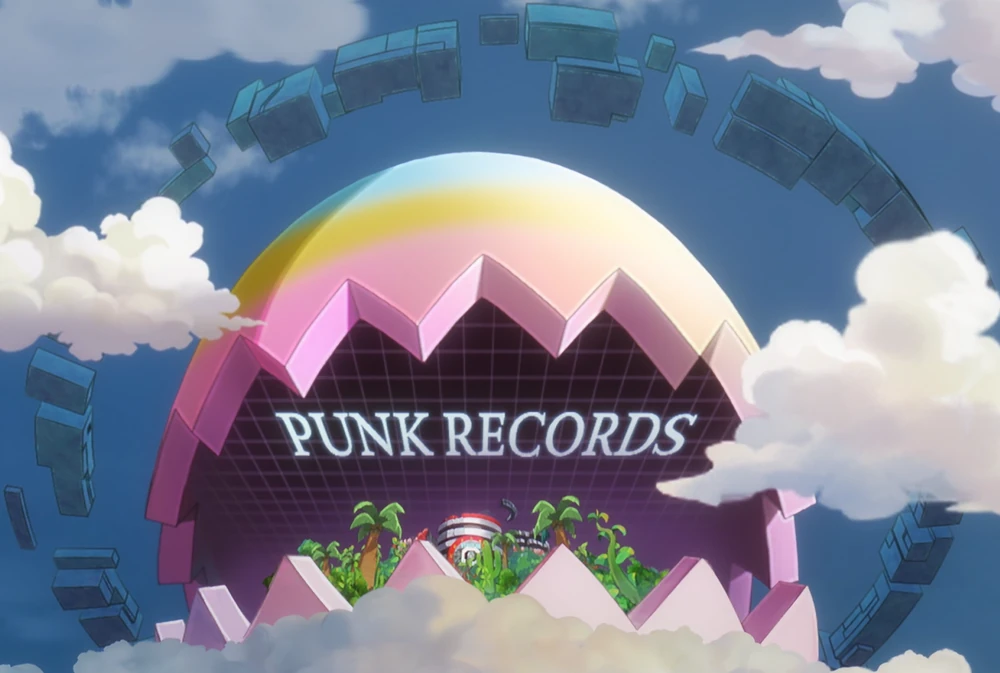
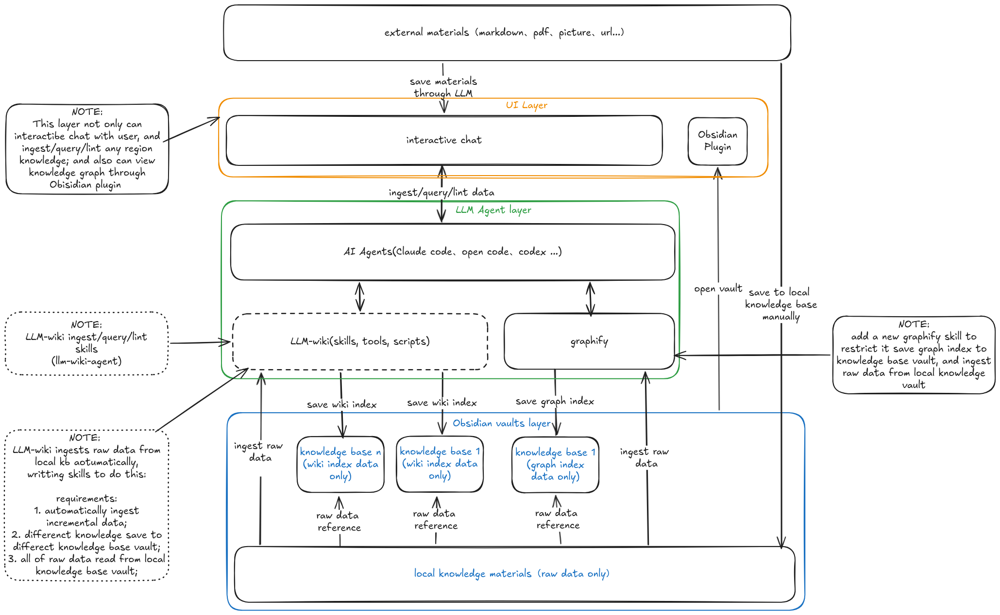

# PunkRecords (班克记录)

像贝加庞克一样，将你的大脑外化为无限的智慧仓库。连接 LLM 与个人 Wiki，让零散的笔记与灵感在此汇聚、碰撞、重生——这是属于你的"班克记录"，一个会思考的第二大脑。

## 特性

- 🤖 **多 AI 代理支持** - 兼容 Claude Code、Codex、OpenCode 等多种 AI 编码代理
- 📊 **知识图谱构建** - 内置 graphify 将输入内容自动转化为结构化知识图谱
- 🔗 **Obsidian 原生集成** - 提供 Obsidian 插件直接打开关系图谱可视化
- 💬 **交互式对话** - 通过聊天界面与你的知识库进行交互查询
- 📁 **分层知识组织** - 原材料与索引分离，支持多领域知识独立管理
- 🔍 **智能知识处理** - AI 代理自动完成知识摄取、查询和整理

## 架构概览

PunkRecords 采用清晰的三层架构设计：

### 第一层：UI 层
- **交互式聊天界面** - 用户与 AI 代理进行自然语言交互
- **Obsidian 插件** - 直接打开 Obsidian Vault 查看知识关系图谱

### 第二层：LLM 代理层
- **AI 代理核心** - 支持多种 LLM 代理（Claude Code、Codex、OpenCode 等），负责知识摄取、查询和整理
- **graphify** - 开源组件，将内容转化为知识图谱
- **LLM Wiki** - 可选组件，提供额外的维基组织能力

### 第三层：Obsidian Vaults 层
- **本地知识库原材料 Vault** - 存储原始知识材料，按领域分类目录组织
- **领域知识索引 Vaults** - 每个领域独立一个 Vault，仅存储 Wiki 索引和图谱索引数据，索引中引用原材料 Vault 的原始数据

## 核心理念

PunkRecords 相信：
- **你的知识已经存在** - 不需要迁移，基于你现有的 Obsidian 笔记工作流
- **AI 是协作伙伴** - 帮助你整理、连接和发现知识间的关联
- **分层存储** - 原材料与索引分离，兼顾灵活性和性能
- **开放架构** - 支持多种 AI 后端，不绑定特定服务商

## 开始使用

> 项目开发中，敬请期待...

## 路线图

- [ ] 基础代理框架实现
- [ ] graphify 知识图谱构建集成
- [ ] Obsidian 插件开发
- [ ] 多 Vault 知识索引管理
- [ ] 交互式聊天界面
- [ ] 支持多种 AI 代理后端

